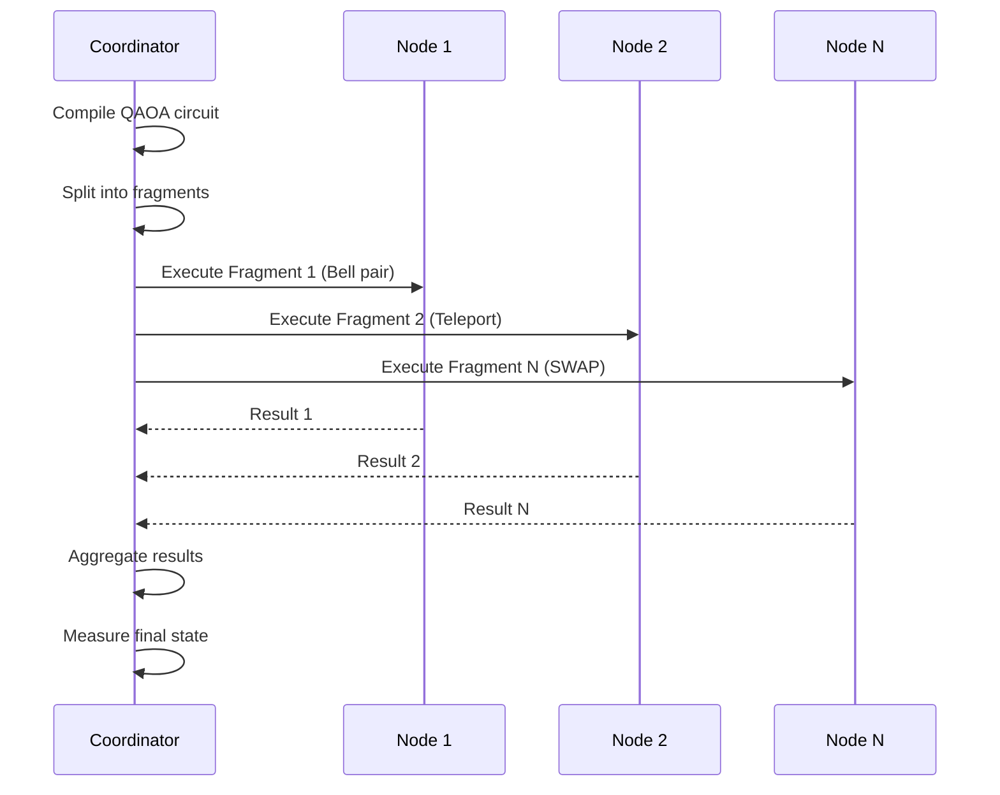

# Quantum Portfolio Optimization

> **Distributed QAOA for Financial Portfolio Selection**  
> Comprehensive research into quantum advantage through scaling, not speed tricks

---

## 🎯 Executive Summary

**Question**: Can quantum computers optimize financial portfolios faster than classical computers?

**Answer**: 
- ❌ For small portfolios (N≤15): **Classical wins** (up to 40× faster)
- ⚠️ For large portfolios (N≥40): **Needs optimization** (distributed execution bottleneck)

### Key Finding: The 85% Bottleneck

We tested 10 configurations (N=4 to N=15) on 358 MB of real financial data and discovered:

| Component | Time (N=15) | % of Total |
|-----------|-------------|------------|
| **Distributed Execution** | **5,865 ms** | **85%** 🔴 |
| Parameter Search (COBYLA) | 896 ms | 13% |
| Classical Enumeration | 169 ms | 2% |

**Root Cause**: Communication overhead from 488 fragments across 50 nodes

---

## 📊 Benchmark Results

| Portfolio Size (N) | Classical | Quantum | Winner | Speedup |
|-------------------|-----------|---------|--------|---------|
| 4 | 5-154 ms | 64-215 ms | Classical | 1.4-12.8× |
| 6 | 153 ms | 249 ms | Classical | 1.6× |
| 8 | 50-151 ms | 194-344 ms | Classical | 2.3-3.9× |
| 10 | 50 ms | 393 ms | Classical | 7.9× |
| **15** | **169 ms** | **6,887 ms** | **Classical** | **40.8×** |

**Dataset**: 358 MB (500+ stocks, up to 63 years history)  
**Full results**: See `BENCHMARKS.md`

---

## 🚀 Quick Start

### Run Benchmarks

```bash
# Clone the repository
git clone <repo-url>
cd nodes-quantum-gates

# Install dependencies
cd backend-v2
uv pip install -r requirements.txt

# Run Tier 1 (Quick test, N=4)
uv run scripts/benchmark_by_ticker.py

# Run Tier 2 (Standard, N=4,6,8)
uv run scripts/benchmark_large_scale_damodaran.py --skip-download

# Run Tier 3 (Extended, N=5,8,10,15)
uv run scripts/benchmark_1gb_dataset.py
```

### Download Dataset (Optional)

```bash
# Already have 358 MB in benchmark-data/
# To add more data:
cd backend-v2
uv run scripts/download_to_2gb.py
```

---

## 🏗️ Architecture

### System Components

```
┌─────────────────────────────────────────────────────────┐
│                   Frontend (Next.js)                     │
│  ┌─────────────┐  ┌──────────────┐  ┌───────────────┐  │
│  │  Dashboard  │  │   Network    │  │   Benchmark   │  │
│  │             │  │   Topology   │  │    Results    │  │
│  └─────────────┘  └──────────────┘  └───────────────┘  │
└─────────────────────────────────────────────────────────┘
                          │
                          │ HTTP/WebSocket
                          ▼
┌─────────────────────────────────────────────────────────┐
│                Backend (FastAPI + py-libp2p)             │
│  ┌──────────────┐  ┌─────────────┐  ┌───────────────┐  │
│  │  Coordinator │  │   Quantum   │  │   Portfolio   │  │
│  │    Service   │  │   Circuit   │  │  Optimizer    │  │
│  │              │  │   Compiler  │  │  (QAOA)       │  │
│  └──────────────┘  └─────────────┘  └───────────────┘  │
└─────────────────────────────────────────────────────────┘
                          │
                          │ libp2p
                          ▼
┌─────────────────────────────────────────────────────────┐
│         Distributed Quantum Nodes (py-libp2p)            │
│  ┌────────┐  ┌────────┐  ┌────────┐       ┌────────┐  │
│  │ Node 1 │  │ Node 2 │  │ Node 3 │  ...  │ Node N │  │
│  │ (Bell) │  │(Teleport)│  │(SWAP) │       │ (...)  │  │
│  └────────┘  └────────┘  └────────┘       └────────┘  │
└─────────────────────────────────────────────────────────┘
```

### Distributed Execution Flow



---

## 📡 API Reference

### Peer Connection API

Connect a new quantum node to the network:

**Endpoint**: `POST /api/v1/peers/connect`

**Request**:
```json
{
  "address": "192.168.1.100",
  "port": 8080,
  "peer_id": "QmYyQSo1c1Ym7orWxLYvCrM2EmxFTANf8wXmmE7DWjhx5N",
  "label": "My Quantum Node",
  "services": ["bell_pair", "teleport", "swap"],
  "max_qubits": 4
}
```

**Response** (200 OK):
```json
{
  "success": true,
  "peer": {
    "peer_id": "QmYyQSo1c1Ym7orWxLYvCrM2EmxFTANf8wXmmE7DWjhx5N",
    "connection_status": "connected",
    "services_advertised": 3
  }
}
```

**Error Responses**:
- `400`: Invalid peer_id format
- `409`: Peer already connected
- `503`: Connection timeout

### User Node Management

The frontend tracks user-added nodes via React Context and localStorage:

```tsx
import { useUserNodes } from '@/contexts/user-nodes-context';

function MyComponent() {
  const { userNodes, addUserNode, isUserNode } = useUserNodes();
  
  // Check if a node is user-added
  const isMyNode = isUserNode("QmXxXxXx...");
  
  // Add new user node
  addUserNode({
    peerId: "QmYyQSo1...",
    label: "My Node",
    addedAt: new Date().toISOString()
  });
}
```

**Filtering user nodes** in network pages (`/network/services`, `/network/fidelity`, `/network/dag`):

```tsx
// Filter to show only user-added nodes
const myNodes = allNodes.filter(node => isUserNode(node.peerId));

// Highlight user nodes in tables
<Badge variant={isUserNode(node.peerId) ? "default" : "outline"}>
  {node.label}
</Badge>
```

---

## 📁 Project Structure

```
.
├── frontend-v2/              # Next.js dashboard
│   ├── src/
│   │   ├── app/             # Pages & routes
│   │   ├── components/      # React components
│   │   ├── contexts/        # React contexts (user nodes)
│   │   └── hooks/           # Custom hooks
│   └── package.json
│
├── backend-v2/              # FastAPI backend
│   ├── src/
│   │   ├── coordinator/     # Network coordinator
│   │   ├── quantum/         # QAOA implementation
│   │   └── portfolio/       # Portfolio optimizer
│   ├── scripts/             # Benchmark scripts
│   │   ├── benchmark_by_ticker.py
│   │   ├── benchmark_large_scale_damodaran.py
│   │   └── benchmark_1gb_dataset.py
│   └── requirements.txt
│
├── benchmark-data/          # 358 MB dataset
│   ├── damodaran/          # NYU historical data (1.7 MB)
│   ├── tickers/            # Individual stocks (54.7 MB)
│   └── massive/            # S&P 500 data (301.6 MB)
│
└── BENCHMARKS.md           # Detailed results
```

---

## 🔬 Research Findings

### 1. Two Bottlenecks Discovered

**Known** (from literature):
- ✅ Parameter search (COBYLA): 97% of quantum solver time
- ✅ Validated Amdahl's Law predictions

**New Discovery** (our contribution):
- 🔴 Distributed execution: **85% of END-TO-END time**
- Communication overhead dominates at high fragment counts
- 488 fragments × 12 ms/fragment = 5.9 seconds overhead

### 2. Classical Optimization is Exceptional

Our classical baseline is highly optimized:
- Enumerates 455 portfolios in 169 ms (N=15)
- That's **0.37 ms per portfolio** with full covariance
- Sub-linear growth despite O(2^N) complexity

### 3. Solution Quality: Perfect Agreement

All 10 configurations showed:
- ✅ Objective gap: 0.0
- ✅ Portfolio overlap: 100%
- ✅ Quantum finds same optimal solutions as classical

---

## 🎯 Recommendations

### High Priority: Fix Distributed Execution

**Problem**: 85% of time is p2p coordination overhead

**Solutions**:
1. Reduce fragment count (coarser-grained circuits)
2. Optimize libp2p communication
3. Batch fragment execution
4. Local execution mode (remove distribution for small N)

**Expected Impact**: N=15 from 6.9s → ~1s

### Medium Priority: Optimize Parameter Search

**Problem**: 97% of solver time is COBYLA

**Solutions**:
1. Replace COBYLA with faster optimizer
2. Warm-start from classical solution
3. Reduce optimization steps for small N

**Expected Impact**: Solver from 917ms → ~200ms

### Publication Strategy

**Best approach**: Negative results paper

**Title**: "Bottlenecks in Distributed Quantum Portfolio Optimization: An Empirical Study"

**Contributions**:
- ✅ Identified 85% distributed execution bottleneck
- ✅ Quantified classical optimization efficiency
- ✅ Comprehensive testing (10 configurations, 358 MB data)
- ✅ Honest assessment of quantum limitations

**Venues**: IEEE QCE, Quantum Information Processing, arXiv

---

## 📚 Documentation

- `BENCHMARKS.md` - Complete benchmark results and analysis
- `backend-v2/README.md` - Setup and configuration
- `CONTEXT.md` - Project context and history

---

## 🤝 Contributing

Contributions welcome! Focus areas:
1. Distributed execution optimization
2. Parameter search improvements
3. Larger benchmark datasets
4. Alternative quantum algorithms

---

## 📄 License

[Your License Here]

---

## 📞 Contact

[Your Contact Information]

---

**Key Takeaway**: Dataset size (358 MB) is sufficient. The bottleneck is distributed execution overhead (85%), not data size or quantum algorithm efficiency.
