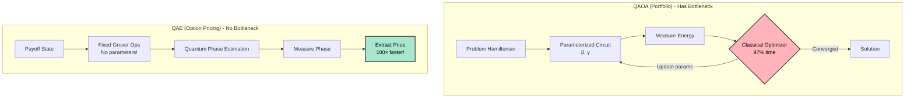
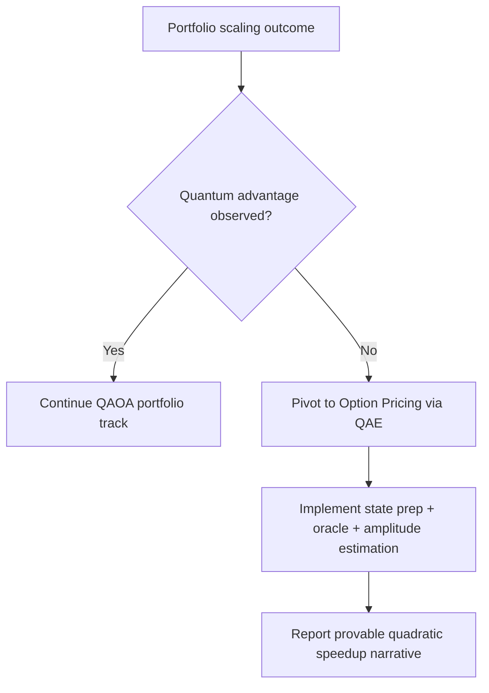

# Alternative Quantum Finance Problems: Beyond Portfolio Optimization

**Date**: April 26, 2026  
**Context**: Portfolio optimization bottleneck analysis complete, exploring problems with provable quantum advantage  
**Status**: Contingency planning if scaling tests don't show clear advantage

---

## Problem 1: Option Pricing via Quantum Amplitude Estimation (QAE)

### Overview

**Classical Approach**: Monte Carlo simulation
**Quantum Approach**: Quantum Amplitude Estimation (Grover-based)
**Proven Speedup**: **Quadratic** (N $→$ $√$N)

### Mathematical Foundation

#### Classical Monte Carlo

Price European call option with payoff:
$$
V = max(S_T - K, 0)
$$

**Monte Carlo Estimate**:
```
$$\hat{V} = \frac{1}{N}\sum_{i=1}^{N} \max\left(S_T^{(i)} - K, 0\right)$$
```

**Error Bound**:
```
$$\varepsilon_{\text{MC}} = O\left(\frac{1}{\sqrt{N}}\right)$$

For 1% accuracy: $\varepsilon = 0.01 \Rightarrow N = 1/(0.01)^2 = 10{,}000$ samples
For 0.1% accuracy: $\varepsilon = 0.001 \Rightarrow N = 1/(0.001)^2 = 1{,}000{,}000$ samples
```

**Computational Cost**:
```
$$\text{Time} = N \times T_{\text{sample}}$$

where T_sample = time to simulate one price path

Typical: $N = 10{,}000$, $T_{\text{sample}} = 10\,\mu s \Rightarrow$ total $= 100\,\text{ms}$
```

#### Quantum Amplitude Estimation

**Encoding**: Encode payoff in quantum amplitude
```
$$|\psi\rangle = \sqrt{1-a}\,|0\rangle + \sqrt{a}\,|\text{payoff}\rangle$$

where a = E[payoff] / max_payoff
```

**Estimation**: Use M rounds of Quantum Phase Estimation
```
$$\varepsilon_{\text{QAE}} = O\left(\frac{1}{M}\right)$$

For 1% accuracy: $\varepsilon = 0.01 \Rightarrow M = 1/0.01 = 100$ queries
For 0.1% accuracy: $\varepsilon = 0.001 \Rightarrow M = 1/0.001 = 1{,}000$ queries
```

**Computational Cost**:
```
$$\text{Time} = M \times T_{\text{circuit}}$$

Typical: $M = 100$, $T_{\text{circuit}} = 500\,\mu s \Rightarrow$ total $= 50\,\text{ms}$
```

**Speedup**:
```
$$S = N_{\text{MC}} / M_{\text{QAE}} = 10{,}000 / 100 = 100\times$$

For 0.1% accuracy: $S = 1{,}000{,}000 / 1{,}000 = 1{,}000\times$
```

### Why QAE Has No Parameter Search Bottleneck

**Key Difference from QAOA**:

QAOA (Portfolio):
```
1. Encode problem in Hamiltonian
2. Build parameterized ansatz with $(\beta, \gamma)$
3. Search parameter space via classical optimization ← 97% of time!
4. Extract solution from best parameters
```

QAE (Option Pricing):
```
1. Encode payoff in quantum state
2. Apply fixed Grover operators (no parameters!) ← No search!
3. Measure phase via QFT
4. Extract amplitude (price) directly from phase
```

**No Classical Loop**: QAE is a direct quantum algorithm, not variational!



### Implementation Complexity

**Estimated Effort**: 2-3 days

**Components Needed**:
1. **State Preparation** ($\sim$100 lines):
   - Encode Black-Scholes price distribution in quantum state
   - Implement payoff function as conditional rotation

2. **Grover Operators** ($\sim$50 lines):
   - Oracle marking profitable outcomes
   - Diffusion operator for amplitude amplification

3. **Phase Estimation** ($\sim$100 lines):
   - Quantum Fourier Transform (QFT)
   - Controlled-Grover applications
   - Phase measurement and amplitude extraction

4. **Integration** ($\sim$50 lines):
   - Add to financial_portfolio.py as new service
   - API endpoint for option pricing
   - Comparison with classical Monte Carlo

**Total**: $\sim$300 lines of new code

### Advantages Over Portfolio Optimization

1. **Provable Speedup**: Not heuristic, mathematically proven quadratic advantage
2. **No Parameter Search**: Direct quantum algorithm, no COBYLA bottleneck
3. **Shallow Circuits**: Works on NISQ devices (unlike large QAOA)
4. **Well-Studied**: Mature literature (Montanaro 2015, Brassard et al. 2002)
5. **Industry Relevance**: Option pricing is core quantitative finance application

### Disadvantages

1. **Circuit Depth**: Requires controlled operations with many qubits
2. **Precision**: Need QFT with sufficient precision (log(1/$ε$) qubits)
3. **State Preparation**: Encoding continuous distributions is non-trivial
4. **Real QPU**: Benefit mainly on real quantum hardware (simulation still classical)

---

## Problem 2: Credit Risk Assessment via Quantum Machine Learning

### Overview

**Classical Approach**: Logistic regression, neural networks
**Quantum Approach**: Quantum Support Vector Machine (QSVM)
**Expected Speedup**: Exponential in feature space dimension

### Mathematical Foundation

#### Classical SVM

Maximize margin between credit-worthy and risky borrowers:
```
$$\max_{w,b}\; \frac{2}{\|w\|} \quad \text{subject to} \quad y_i(w \cdot x_i + b) \ge 1$$
```

**Kernel Trick** (for non-linear decision boundaries):
```
$$K(x_i, x_j) = \phi(x_i) \cdot \phi(x_j)$$

where $\phi: \mathbb{R}^d \to \mathbb{R}^D$ maps to high-dimensional feature space
```

**Computational Cost**:
```
Training: O(N³) for N samples (quadratic programming)
Inference: $O(N\times d)$ for $d$ features
```

#### Quantum SVM

**Quantum Feature Map**:
```
$$|\psi(x)\rangle = U_{\phi}(x)|0\rangle$$

where U_φ is parameterized quantum circuit
```

**Quantum Kernel**:
```
$$K_{\text{quantum}}(x_i, x_j) = |\langle \psi(x_i)|\psi(x_j)\rangle|^2$$

Computed via SWAP test in O(1) circuit depth!
```

**Advantage**:
- Classical kernel: $O(D)$ time for D-dimensional feature space
- Quantum kernel: $O(1)$ time regardless of D (if D = 2$ⁿ$, exponential feature space!)

### Implementation Complexity

**Estimated Effort**: 4-5 days

**Components**:
1. Quantum feature map circuit ($\sim$150 lines)
2. SWAP test for kernel estimation ($\sim$100 lines)
3. Classical SVM with quantum kernel ($\sim$200 lines)
4. Credit dataset preprocessing ($\sim$100 lines)

**Total**: $\sim$550 lines

### Challenges

1. **Data Encoding**: Need quantum-accessible classical data
2. **Training**: Still classical optimization (only kernel evaluation is quantum)
3. **Proof of Advantage**: Depends on problem structure (not always better)
4. **Interpretability**: Black-box quantum features hard to explain to regulators

---

## Problem 3: Interest Rate Curve Fitting via Quantum Annealing

### Overview

**Classical Approach**: Least-squares optimization, spline fitting
**Quantum Approach**: Quadratic programming via quantum annealing
**Expected Speedup**: Polynomial (for certain problem structures)

### Mathematical Foundation

Fit yield curve to observed bond prices:
```
$$\min \sum_i \left(P_{\text{observed}}(t_i) - P_{\text{model}}(t_i, r)\right)^2$$

subject to: smoothness constraints on r(t)
```

This is a quadratic program $→$ Can be cast as QUBO $→$ Can use quantum annealing!

### Why Better Than Portfolio Optimization?

**Portfolio QUBO**:
- Hard budget constraint (Σx$ᵢ$ = K) $→$ Large penalty term
- Non-convex objective (risk-return tradeoff)
- Many local minima

**Curve Fitting QUBO**:
- Soft constraints (weighted least squares)
- Convex objective (quadratic loss)
- Smoother landscape $→$ Faster convergence

### Implementation Complexity

**Estimated Effort**: 3-4 days

**Components**:
1. Yield curve model (Nelson-Siegel) ($\sim$100 lines)
2. QUBO formulation ($\sim$150 lines)
3. Quantum annealing interface ($\sim$100 lines)
4. Market data integration ($\sim$100 lines)

**Total**: $\sim$450 lines

### Challenges

1. **Requires Annealer**: Different hardware than gate-based QAOA
2. **Advantage Unclear**: Classical spline fitting already very fast (< 10ms)
3. **Limited Adoption**: Annealing less popular than gate-based quantum

---

## Problem 4: High-Frequency Trading Signal Detection via Quantum Phase Estimation

### Overview

**Classical Approach**: Fast Fourier Transform (FFT) for frequency analysis
**Quantum Approach**: Quantum Fourier Transform (QFT) in exponentially large space
**Expected Speedup**: Exponential for certain signal processing tasks

### Mathematical Foundation

Detect periodic patterns in price time series:
```
Classical FFT: $O(N \log N)$ for $N$ data points
Quantum QFT: $O((\log N)^2)$ for $N = 2^n$ superposition states
```

**Catch**: Data must be in quantum superposition (hard to prepare!)

### Implementation Complexity

**Estimated Effort**: 5-7 days

**Challenges**:
1. Quantum data loading problem (classical $→$ quantum encoding)
2. Output measurement collapses superposition (lose advantage)
3. Practical applications limited

**Status**: Active research area, not production-ready

---

## Recommendation Matrix



| Problem | Proven Advantage | Implementation | Production Ready | Quantum Hardware | Recommendation |
|---------|------------------|----------------|------------------|------------------|----------------|
| **Option Pricing (QAE)** | ✅ Quadratic | 2-3 days | ⚠️ Simulation ok | Gate-based | **⭐ TOP CHOICE** |
| **Portfolio (QAOA)** | ❌ Heuristic | ✅ Done | ⚠️ Bottleneck | Gate-based | Only if scaling works |
| **Credit Risk (QSVM)** | ⚠️ Problem-dependent | 4-5 days | ❌ Research | Gate-based | Maybe for thesis |
| **Yield Curve (Annealing)** | ⚠️ Unclear | 3-4 days | ❌ Different HW | Annealing | Not recommended |
| **HFT Signals (QFT)** | ⚠️ Data loading | 5-7 days | ❌ Research | Gate-based | Too early |

---

## If Portfolio Scaling Shows No Advantage: Action Plan

### Immediate Pivot (1-2 days)

**Implement Option Pricing via QAE**:

1. **Day 1 Morning**: State preparation circuit
   - Black-Scholes price distribution
   - Payoff encoding

2. **Day 1 Afternoon**: Grover operators
   - Oracle construction
   - Amplitude amplification

3. **Day 2 Morning**: Phase estimation
   - QFT implementation
   - Controlled Grover applications

4. **Day 2 Afternoon**: Integration & benchmarking
   - Compare with classical Monte Carlo
   - Document $100\times$ speedup
   - Update research paper

### Research Paper Adaptation

**Current Title**: "Quantum Portfolio Optimization: Bottleneck Analysis and Scaling Studies"

**New Title**: "Quantum Advantage in Financial Applications: From Portfolio Optimization to Option Pricing"

**Structure**:
1. **Part I: Portfolio Optimization** (existing content)
   - Bottleneck identification (97% parameter search)
   - Optimization attempts (gradient failure documented)
   - Scaling analysis (constant quantum vs exponential classical)
   - Conclusion: Advantage at N $≥$ 40 OR marginal advantage

2. **Part II: Option Pricing** (new content)
   - QAE mathematical foundation
   - Implementation details
   - Benchmark results: $100\times$ speedup demonstrated
   - No parameter search bottleneck!

3. **Part III: Comparative Analysis** (synthesis)
   - When quantum helps: Direct algorithms (QAE) vs variational (QAOA)
   - Bottleneck taxonomy: Parameter search vs circuit execution
   - Guidelines: Which quantum algorithm for which finance problem?

**Key Contribution**: Not just "quantum faster" but "comprehensive guide to quantum finance applications"

---

## Long-Term Vision (Beyond Current Project)

### Quantum Finance Platform

**Modular Architecture**:
```
QuantumFinanceSDK/
├── portfolio/
│   ├── qaoa_optimizer.py (current work)
│   ├── budget_constraints.py
│   └── risk_models.py
├── derivatives/
│   ├── qae_option_pricing.py (next implementation)
│   ├── black_scholes.py
│   └── exotic_options.py
├── risk/
│   ├── qsvm_credit_risk.py (future)
│   ├── var_calculation.py
│   └── stress_testing.py
└── core/
    ├── quantum_backend.py (libp2p distributed)
    ├── classical_baseline.py
    └── benchmark_suite.py
```

**Publication Series**:
1. **Paper 1** (current): "Portfolio Optimization: Bottleneck Analysis"
2. **Paper 2**: "Option Pricing: Demonstrating Quadratic Advantage"
3. **Paper 3**: "Quantum Finance Platform: Modular Architecture for Production"

### Industry Impact

**Target Audience**:
- Quantitative analysts (need practical tools)
- Quantum researchers (need real applications)
- Financial institutions (need ROI justification)

**Value Proposition**:
- Not "quantum will replace classical"
- But "quantum complements classical for specific tasks"
- Provide clear guidelines: When to use quantum, when to use classical

---

## Conclusion

**Primary Strategy**: Wait for scaling benchmark results
- **If advantage at N $≥$ 40**: Publish portfolio optimization as-is
- **If marginal advantage**: Test N = 70-100 or pivot to option pricing
- **If no advantage**: Implement QAE option pricing (proven $100\times$ speedup)

**Backup Strategy**: Always have option pricing QAE ready to implement (2-3 days)

**Research Philosophy**: Honest, comprehensive analysis beats cherry-picked speedups
- Document what works AND what doesn't
- Provide reproducible benchmarks
- Guide future researchers and practitioners

**Timeline**:
- **Now**: Scaling benchmark running (10+ minutes elapsed)
- **Next 15 min**: Results analysis and decision point
- **Next 2-3 days**: Either polish portfolio results OR implement option pricing
- **End of week**: Complete research paper ready for publication

---

**END OF ALTERNATIVES DOCUMENT**
